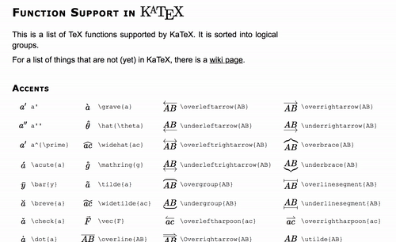

The best LaTex cheat sheet I've found is: **[KaTeX documentation](https://khan.github.io/KaTeX/function-support.html)**.

<post-separator></post-separator>

LaTeX is great for displaying equations. This code:

```latex
\begin{bmatrix}
    x_{11} & x_{12} & x_{13} & \ldots  & x_{1n} \\
    x_{21} & x_{22} & x_{23} & \ldots  & x_{2n} \\
    \vdots & \vdots & \vdots & \ddots & \vdots \\
    x_{d1} & x_{d2} & x_{d3} & \ldots  & x_{dn}
\end{bmatrix}
```

…will render:

$$
\begin{bmatrix}
    x_{11} & x_{12} & x_{13} & \ldots  & x_{1n} \\
    x_{21} & x_{22} & x_{23} & \ldots  & x_{2n} \\
    \vdots & \vdots & \vdots & \ddots & \vdots \\
    x_{d1} & x_{d2} & x_{d3} & \ldots  & x_{dn}
\end{bmatrix}
$$

But it's hard to remember all the commands. So here's the cheatsheet:

## [KaTeX documentation](https://khan.github.io/KaTeX/function-support.html)



[KaTeX](https://khan.github.io/KaTeX/) is a way to display LaTeX equations on a browser.

[Its documentation page](https://khan.github.io/KaTeX/function-support.html) works as a great LaTeX cheat sheet, because you can search for and copy equations easily. I recommend bookmarking this page.
