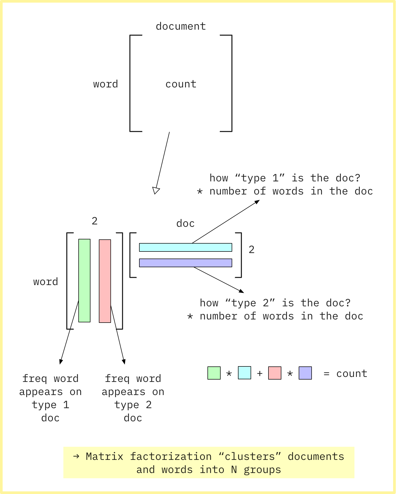

I started watching [fast.ai's Computational Linear Algebra course](http://www.fast.ai/2017/07/17/num-lin-alg/). Here's some (very) quick takeaways from lecture 2.

<post-separator></post-separator>

<div><responsive-iframe width="560" height="315" src="https://www.youtube.com/embed/kgd40iDT8yY" frameborder="0" allow="autoplay; encrypted-media" allowfullscreen></responsive-iframe></div>

**Read this first:** [jupyter notebook for the lecture](https://github.com/fastai/numerical-linear-algebra/blob/master/nbs/2.%20Topic%20Modeling%20with%20NMF%20and%20SVD.ipynb)

## Some Visualization

Here's the text that talks about the motivation behind topic modeling using matrix factorization. I added some visualizations to help visualize what Rachel's talking about.

### Matrix Factorization, Motivation 1

> Consider the most extreme case - reconstructing the matrix using an outer product of two vectors. Clearly, in most cases we won't be able to reconstruct the matrix exactly. But if we had one vector with the relative frequency of each vocabulary word out of the total word count, and one with the average number of words per document, then that outer product would be as close as we can get.


### Matrix Factorization, Motivation 2

> Now consider increasing that matrices to two columns and two rows. The optimal decomposition would now be to cluster the documents into two groups, each of which has as different a distribution of words as possible to each other, but as similar as possible amongst the documents in the cluster. We will call those two groups "topics". And we would cluster the words into two groups, based on those which most frequently appear in each of the topics.



### SVD

> We would clearly expect that the words that appear most frequently in one topic would appear less frequently in the other - otherwise that word wouldn't make a good choice to separate out the two topics. Therefore, we expect the topics to be orthogonal.
>
> The SVD algorithm factorizes a matrix into one matrix with orthogonal columns and one with orthogonal rows (along with a diagonal matrix, which contains the relative importance of each factor).


### NMF

> Nonnegative matrix factorization (NMF) is a non-exact factorization that factors into one skinny positive matrix and one short positive matrix.

### My visualization


## Coding Tips

Use [`CountVectorizer`](http://scikit-learn.org/stable/modules/feature_extraction.html#text-feature-extraction) to tokenize words:

```python
from sklearn.feature_extraction.text import CountVectorizer
vectorizer = CountVectorizer(stop_words='english')
vectors = vectorizer.fit_transform(data).todense()
```

Use `%time` magic to calculate wait time:

```python
%time U, s, Vh = linalg.svd(...)
```

`np.diag` goes two ways:

```python
np.diag(vector) # creates a diagnoal matrix
np.diag(matrix) # returns diagonal entries
```

`np.allclose` checks two floating point matrices are close enough:

```python
np.allclose(matrix_1, matrix_2)
```

To check if a matrix is orthonormal, multiply by its transpose and see if it's an identity matrix:

```python
# You want to check columns of U are orthonormal,
# so you want to multiply with
# U.T on the **left**, so it ends up computing
# dot product of each columns.
# Also, shape[1] gets number of columns
np.allclose(U.T @ U, np.eye(U.shape[1]))
```

To do NMF on `sklearn`, matrix needs to be at least as tall as it is wide, or we get an error with `fit_transform`.

```python
clf = decomposition.NMF(n_components=d, random_state=1)
W1 = clf.fit_transform(vectors)
H1 = clf.components_
```

## Cool Links

- [Text Analysis with Topic Models for the Humanities and Social Sciences](https://de.dariah.eu/tatom/index.html)
