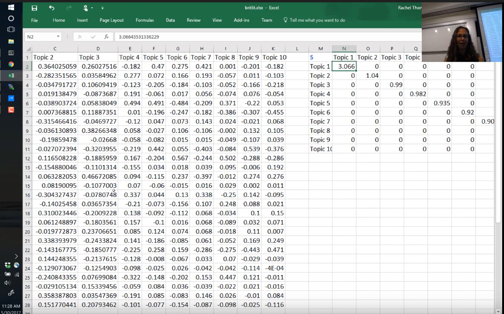

Here's some (very) quick takeaways from [fast.ai's Computational Linear Algebra course](http://www.fast.ai/2017/07/17/num-lin-alg/), lecture 3.

<post-separator></post-separator>

<responsive-iframe width="560" height="315" src="https://www.youtube.com/embed/C8KEtrWjjyo" frameborder="0" allow="autoplay; encrypted-media" allowfullscreen></responsive-iframe>

**Read this first:** [jupyter notebook for the lecture](https://github.com/fastai/numerical-linear-algebra/blob/master/nbs/2.%20Topic%20Modeling%20with%20NMF%20and%20SVD.ipynb)

## How to think about matrix-vector multiplications and matrix-matrix multiplications

## Excel is a nice way to visualize SVD and NMF, compared to just visualizing on Jupyter

Maybe it'll be even better if we color-code values with conditional formatting.

## Notes about orthonormal matrix

If **columns** of $Q$ is orthonormal, then $Q^TQ$ is an identity matrix, but $QQ^T$ is not.

Orthonormal Matrix times Orthonormal Matrix = Orthonormal. Here's the Proof. If:

$$
\begin{aligned}
Q^TQ &= I \\
R^TR &= I
\end{aligned}
$$

Then:

$$
(QR)^T(QR) = R^T(Q^TQ)R = R^TR = I
$$

## Randomized SVD

A way to find rank `r` approximation of SVD (or "truncated" SVD) *without calculating full SVD*. scikit-learn has a function: [`randomized_svd`](http://scikit-learn.org/dev/modules/generated/sklearn.utils.extmath.randomized_svd.html).

In the lecture, running standard SVD and then taking top 5 singular values took 28 seconds, whereas `randomized_svd` took only 150ms.
