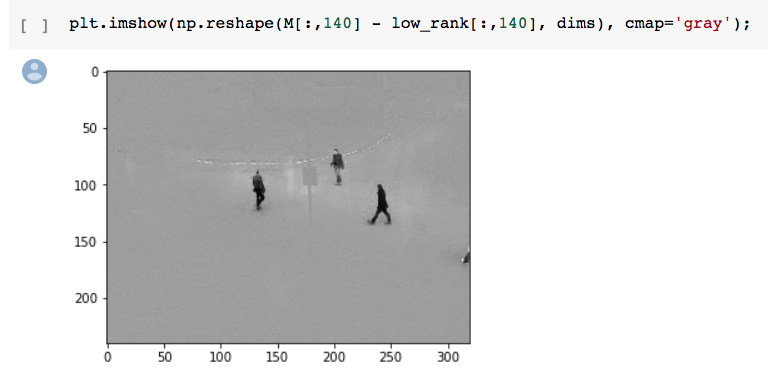
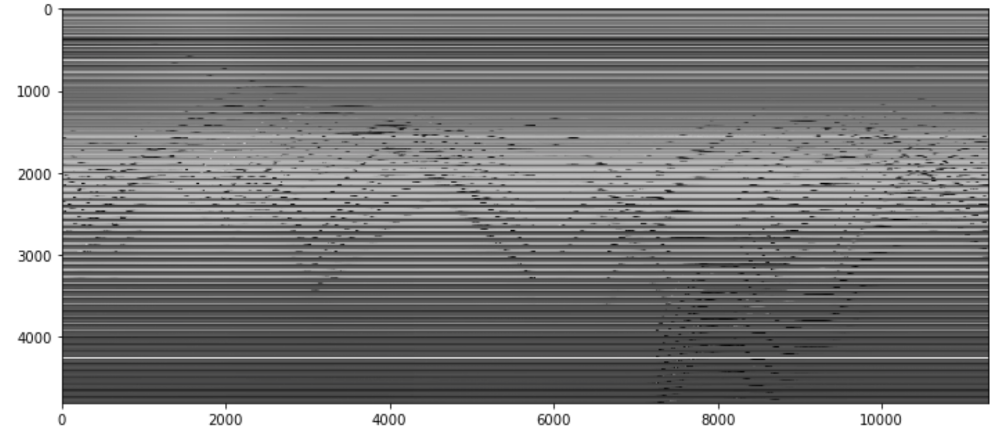
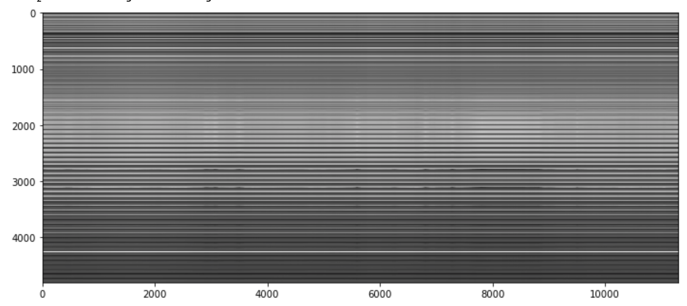

Here's some (very) quick takeaways from [fast.ai's Computational Linear Algebra course](http://www.fast.ai/2017/07/17/num-lin-alg/), lecture 4.

<post-separator></post-separator>

<div><responsive-iframe width="560" height="315" src="https://www.youtube.com/embed/Ys8R2nUTOAk" frameborder="0" allow="autoplay; encrypted-media" allowfullscreen></responsive-iframe></div>

**Read this first:** [jupyter notebook for the lecture](https://github.com/fastai/numerical-linear-algebra/blob/master/nbs/3.%20Background%20Removal%20with%20Robust%20PCA.ipynb)

## numpy.save

Use `numpy.save` to serialize numpy into a file.

```python
np.save(outfile, some_numpy_array)
np.load(outfile)
```

## moviepy

[moviepy](https://github.com/Zulko/moviepy) is useful for video editing.

## Simple technique for background removal from videos

Just compute rank-2 approximation of the original video and subtract it.



Here's the original matrix - **each column corresponds to a single time frame in a video**. The changing parts = people moving, static parts = background.



If you do low-rank approximation on this matrix, you get this - low-rank approximation only preserves the background, dropping the parts where people are moving.



By subtracting this from the original, you'll end up with just the foreground.

## Robust PCA

**Classical PCA** seeks the best rank-k estimate (`L`) of `M`.

**Robust PCA** splits `M` into two matrices so that `M = L + S`, where `L` is low-rank and `S` is sparse.
