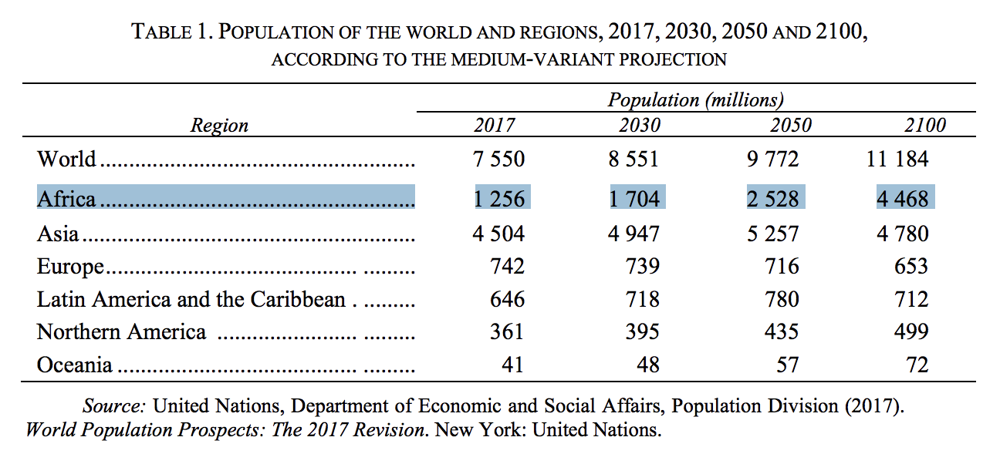
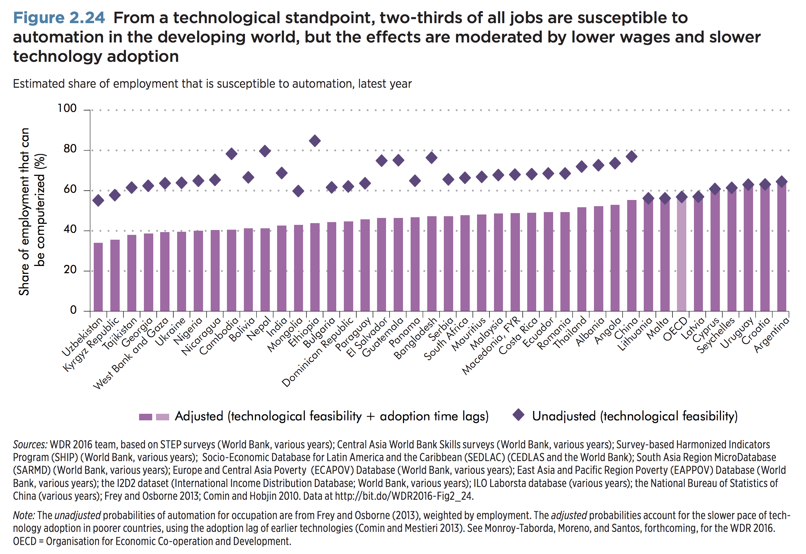

I just finished [Ian Bremmer](https://twitter.com/ianbremmer)'s latest book *[Us vs. Them: The Failure of Globalism](https://www.amazon.com/Us-vs-Them-Failure-Globalism-ebook/dp/B074DG6K8K/).* To me, the most interesting part of the book was **chapter 3**, where Ian, an acclaimed political scientist, talked about the outlook of the 12 most-important developing economies (according to Ian):

1. 🇿🇦 South Africa
1. 🇳🇬 Nigeria
1. 🇪🇬 Egypt
1. 🇸🇦 Saudi Arabia
1. 🇧🇷 Brazil
1. 🇲🇽 Mexico
1. 🇻🇪 Venezuela
1. 🇹🇷 Turkey
1. 🇷🇺 Russia
1. 🇮🇩 Indonesia
1. 🇮🇳 India
1. 🇨🇳 China

In particular, I found Ian's analysis of the **two Sub-Saharan African countries** (🇿🇦 **South Africa** and 🇳🇬 **Nigeria**) most interesting.

<post-separator></post-separator>

## Africa in 2050

First, why am I interested in Sub-Saharan Africa?

**Answer:** Massive upcoming population growth. According to the [2017 UN report](https://esa.un.org/unpd/wpp/Publications/Files/WPP2017_KeyFindings.pdf):

1. Africa's **2017** share of the world's population: **16%** (1.26 billion)
2. Africa's **2050** share of the world's population: **26%** (2.53 billion)
3. Africa's **2100** share of the world's population: **40%** (4.47 billion, almost the same as Asia)

**By 2050, 50%** of the population (more than 1 billion) in Africa will still be **under the age of 25**. We need to create that many jobs in Africa by then, or else we'll face an unprecedented level of unemployment in the continent.

With that, here's what Ian Bremmer said about the two of the most important economies in Sub-Saharan Africa: 🇿🇦 **South Africa** and 🇳🇬 **Nigeria**.

## 🇿🇦 South Africa

- Currently, **20** million people between ages 15-35, but only **6.2** million (**~30%**) have jobs ([source](https://mg.co.za/article/2017-07-13-how-corruption-is-fraying-south-africas-social-and-economic-fabric)).
- Among **black** youth, **40%** are unemployed compared to **11%** of **white** youth ([source](https://www.biznews.com/thought-leaders/2017/07/13/violent-sa-protests-surging-graft/)).
- Growth rate went from **4.8%** (2004-2008) to **1.9%** (2009-2013) to **1.1%** (2014-2016). Zuma was in office from 2009-2018.

According to World Bank's [2018 report](http://documents.worldbank.org/curated/en/530481521735906534/Overcoming-Poverty-and-Inequality-in-South-Africa-An-Assessment-of-Drivers-Constraints-and-Opportunities):

- South Africa is one of the most unequal countries in the world, and that inequality has **increased** since the end of apartheid in 1994.
- The trajectory of poverty reduction was **reversed** between 2011 and 2015.
- The labor market is effectively split into two extreme job types (high-skilled and low-skilled).

## 🇳🇬 Nigeria

Inside the most populous country and the largest economy in Africa:

- [2017 report](https://policy-practice.oxfam.org.uk/publications/the-commitment-to-reducing-inequality-index-a-new-global-ranking-of-governments-620316) by Development Finance International and Oxfam put Nigeria **last** on the list of 152 countries ranked by "commitment to reducing inequality." According to the report, more than 10 million children in Nigeria do not go to school.
- According to the same report, Nigeria is one of the few countries where the number of people living in poverty has **increased** from 69 million in 2004 to 112 million in 2010. The number of millionaires increased by 44%.
- Population is split in half between Christians in the south and Muslims in the poorer north, and the tension is rising.

## Automation

**World bank's [2016 digital dividend report](http://www.worldbank.org/en/publication/wdr2016)**: Around 65% of jobs in Nigeria and South Africa are susceptible to automation, although technology adoption might be slow.

## Buy the book

[Us vs. Them: The Failure of Globalism](https://www.amazon.com/Us-vs-Them-Failure-Globalism-ebook/dp/B074DG6K8K/)
