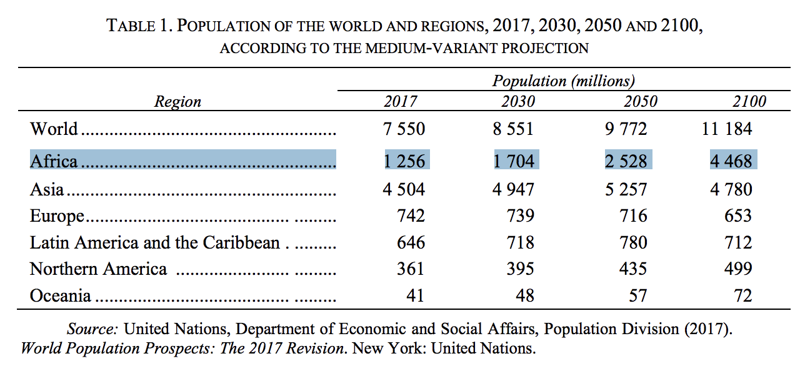

I just finished [Ian Bremmer](https://twitter.com/ianbremmer)'s latest book *[Us vs. Them: The Failure of Globalism](https://www.amazon.com/Us-vs-Them-Failure-Globalism-ebook/dp/B074DG6K8K/).* To me, the most interesting part of the book was **chapter 3**, where Ian, an acclaimed political scientist, talked about the outlook of the 12 most-important developing economies (according to Ian):

1. 🇿🇦 South Africa
1. 🇳🇬 Nigeria
1. 🇪🇬 Egypt
1. 🇸🇦 Saudi Arabia
1. 🇧🇷 Brazil
1. 🇲🇽 Mexico
1. 🇻🇪 Venezuela
1. 🇹🇷 Turkey
1. 🇷🇺 Russia
1. 🇮🇩 Indonesia
1. 🇮🇳 India
1. 🇨🇳 China

In particular, I found Ian's analysis of the **three African countries** (🇿🇦 South Africa, 🇳🇬 Nigeria, and 🇪🇬 Egypt) most interesting. Here's the quick summary.

<post-separator></post-separator>

## Africa in 2050

According to the [2017 UN report](https://esa.un.org/unpd/wpp/Publications/Files/WPP2017_KeyFindings.pdf):

1. Africa's 2017 share of the world's population: 16% (1.26 billion)
2. Africa's 2050 share of the world's population: 26% (2.53 billion)
3. Africa's 2100 share of the world's population: 40% (4.47 billion, almost the same as Asia)

And **by 2050, 50%** of the population (more than 1 billion) in Africa will still be **under the age of 25**. Global capitalists will need to create jobs for them—or else massive unemployment will 

...

## 🇿🇦 South Africa

...

## 🇳🇬 Nigeria

...

## 🇪🇬 Egypt

...
